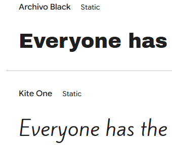
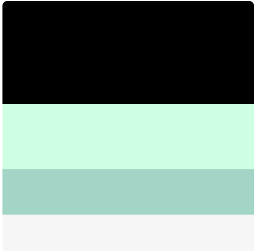
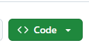
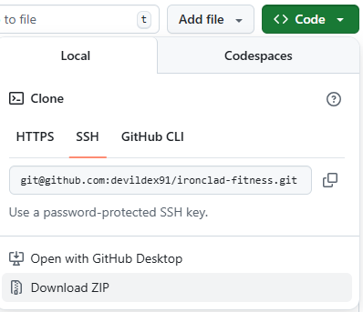

# ironclad-fitness

## Table of Contents 
1. ### UX
+ Primary Goals
+ Business Goals
+ User Goals
+ User Stories 
+ Design Choices 
+ Wireframes 

2. ### Features 
+ Existing Features 
+ Features left to implement

3. ### Technologies used
  
4. ### Testing

5. ### Deployment
+ How to run this project

6. ### Credits 
+ Content
+ Media
+ Code 
+ Acknoledgements

### 1. UX

#### Primary Goals 

The primary goal of Ironclad Fitness is to provide a eye catching, informative, and easy to navigate website that will showcase all the great things about Ironclad Fitness. The main target audience for this website will be current members who want to see what else is avaliable to them at Ironclad Fitness and potential new members looking for somewhere new to train.

#### Business Goals

The main business goal is to bring in new clients by increasing membership intake while decreasing membership fall off after a new year spike. They aim to showcase all of the great benefits of their gym that far outweigh just the equipment on the floor by showcasing what a great community spirit can be gained as well as showcasing that its not just for bodybuilders but a place for every person at every level of fitness.

#### User Goals

+ The user goals for new users are to find somewhere they feel comftable to either start training for the first time or just somewhere they feel better suited to training. 
+ Current members user goals are to check what i going on at the gym such as classes they could book in for or opening hours during holidays as well as any special offers they may be able to take advantage of.

#### User Stories
 + For full Acceptance Criteria and tasks please follow [this link](https://github.com/users/devildex91/projects/4) to the project board for Ironclad Fitness

 +  As a first time visiter to the site I would like everything to be easy to find to so i can easily navigate to wherever I would like to on the site.

 + As a member I would like access to a weekly timetable of classes and special events that are happening.

 + As I have a very busy schedule i would like to be able to find out the busiest times of day by visiting your website so i can fit my visits around my lifestyle without standing around waiting for machines and equipment.
  
  + As a potential new customer i would like to see some images of the different parts of the gym so i can see what machines are being used and to make sure it has the right feel for me.

  + I would like to be able able to view this website on any of my devices so i manage my membership on the go. 
  
  + As a customer I would like to know what experience and qualifications the staff have to make sure that they will be able to help me if i need it. 

  + As a current member I would like to be able to book my place on classes through the website.

#### Design Choices
##### Fonts
+ Archivo black-Titles
+ Kite One- paragraphs  
+ 
+ Archivo one because it is bold and strong and refrences weighgt lifting and Kite one has been chosen for main content as it is easily readable, contrasts well to Archivo and is more of an active looking font to refrence the cardio aspects of gym life.

##### Colours
 + #000000 black
 + #CFFFE2 Mint
 + #A2D5C6 light-cyan
+ #F6F6F6 grey 
+ 
+ I have chosen these colors because black gives it a minimalist feel and has been shwon to add a sense of power as well as the light grey to contrast well with the black and to offer a sense of simplicity and to make it feel larger. The mint and light cyan colours have been added as they have been shown  to offer a sense of tranquility and feeling refreshed. All of these i beleive are key takeaways from what multiple people hope to feel after a gym session. 

##### Styling
+ Firstly the overall responsivness of the website will use bootstrap grid properties with a mixture of built in bootstrap styling and and overiding styles will use a local CSS file.
+ Fonts for styling have been imported from [google fonts.](https://fonts.google.com/selection/embed)
+ The overall colour scheme for the styling has been chosen from [color palete.](https://colorhunt.co/palette/000000cfffe2a2d5c6f6f6f6)  
+ Any favicons added in both the title and within any headings and link for readibility will be taken from [fontawesome.](https://fontawesome.com/)
##### Background 
+ The navbar and footer will be styled with a black background and the light grey from the chosen colours will be used for the font in these for contrast and readability.
+ The main content will use a mixture of the mint and light-cyan to compliment each other with the content being black
##### images

All images have been sourced from [pexels.com](https://www.pexels.com/)

##### Wireframes
+ number of pictures in take the tour page are just for layout purposes as number of photos will likely increase for finished website. 
+ 
+ 
+ 

 ### 2. Features 
 image added to confirmation page for improved look 
 #### Existing Features
+ Navbar altered for larger screens for improved layout
+ footer layout altered from original wireframe for better user experience and improved look.
+ Image added to confirmation page that was not in wireframe to improve the visuals of the page as it looked very bare and boring otherwise.
+ Membership options changed from table to cards which improved the visuals of the page and made it feel less like a spreadsheet.
+title added to key information carousel to make it stand out more and as a way to keep up with whether week 1 or 2 was being used in the whats on section.    
 #### Features left to implement

 + Live updates and peak times have been left to implement at a later date once more data has been collected to provide more accurate results.

 ### 3. Technologies used
  + Visual Studios used as the primary IDE. 
  + Bootstrap(v5.3) for main layout and responsive design.   
  + fontawesome for icons and favicons. 
  + Github for deployment. 
  
 ### 4. Testing

 ### 5. Deployment
 + To view this project use [thislink](#)
 #### To download and work on the code yourself locally. 
 1. Navigate to [devildex91/ironclad-fitness](https://github.com/devildex91/ironclad-fitness)
 2. Click on the green code button  
 3. Select download zip as shown. (This will save a copy of of the repository on your device). .
 4. Once downloaded unpack zipped file to a location of your choosing and you can work on and run the code in an IDE of your choosing(Have fun). 
 + dumbell favicons by <a target="_blank" href="https://icons8.com/icon/9773/dumbbell">Dumbbell</a> icon by <a target="_blank" href="https://icons8.com">Icons8</a>
### 6. Credits

#### Content 

#### Media 
#### Code 
+ responsiveness grid from [bootstrap v5.3](https://getbootstrap.com/)
#### Acknoledgements
+ fonts imported from [google fonts.](https://fonts.google.com/selection/embed) 
+ favicons from [fontawesome.](https://fontawesome.com/) 
+ colourscheme from [color palete.](https://colorhunt.co/palette/000000cfffe2a2d5c6f6f6f6) 

