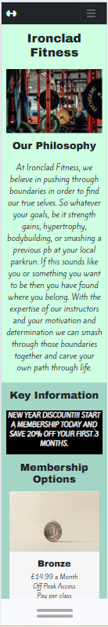
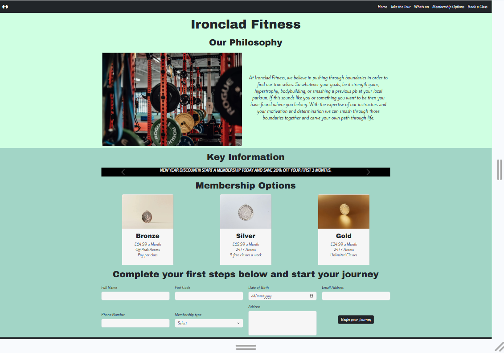
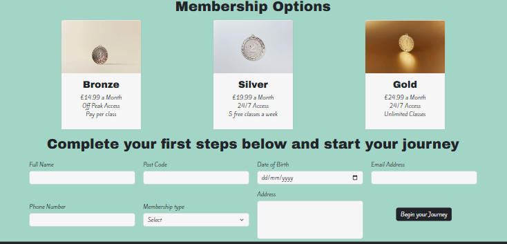
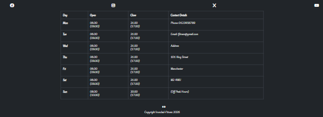
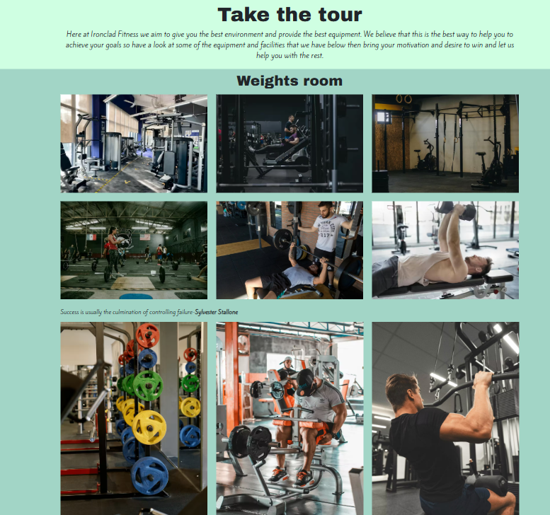
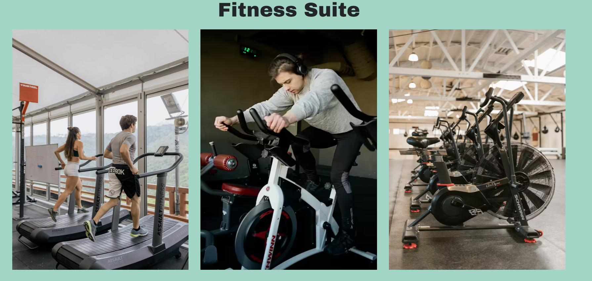
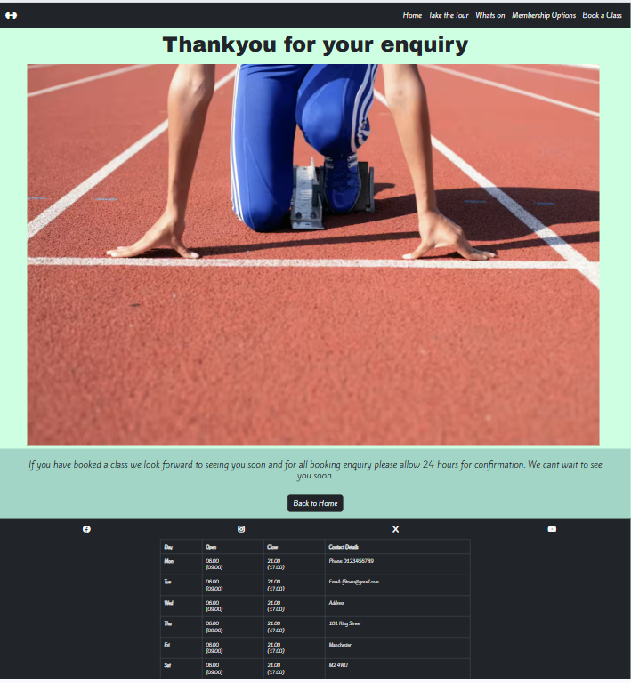
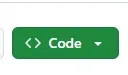

# ironclad-fitness

## Table of Contents 
1. ### UX
+ Primary Goals
+ Business Goals
+ User Goals
+ User Stories 
+ Design Choices 
+ Wireframes 

2. ### Features 
+ Existing Features 
+ Features left to implement

3. ### Technologies used
  
4. ### Testing

5. ### Deployment
+ How to run this project

6. ### Credits 
+ Content
+ Media
+ Code 
+ Acknoledgements

### 1. UX

#### Primary Goals 

The primary goal of Ironclad Fitness is to provide a eye catching, informative, and easy to navigate website that will showcase all the great things about Ironclad Fitness. The main target audience for this website will be current members who want to see what else is avaliable to them at Ironclad Fitness and potential new members looking for somewhere new to train.

#### Business Goals

The main business goal is to bring in new clients by increasing membership intake while decreasing membership fall off after a new year spike. They aim to showcase all of the great benefits of their gym that far outweigh just the equipment on the floor by showcasing what a great community spirit can be gained as well as showcasing that its not just for bodybuilders but a place for every person at every level of fitness.

#### User Goals

+ The user goals for new users are to find somewhere they feel comfortable to either start training for the first time or just somewhere they feel better suited to training. 
+ Current members user goals are to check what i going on at the gym such as classes they could book in for or opening hours during holidays as well as any special offers they may be able to take advantage of.

#### User Stories
 + For full Acceptance Criteria and tasks please follow [this link](https://github.com/users/devildex91/projects/4) to the project board for Ironclad Fitness

 +  As a first time visiter to the site I would like everything to be easy to find to so i can easily navigate to wherever I would like to on the site.

 + As a member I would like access to a weekly timetable of classes and special events that are happening.

 + As I have a very busy schedule i would like to be able to find out the busiest times of day by visiting your website so i can fit my visits around my lifestyle without standing around waiting for machines and equipment.
  
  + As a potential new customer i would like to see some images of the different parts of the gym so i can see what machines are being used and to make sure it has the right feel for me.

  + I would like to be able able to view this website on any of my devices so i manage my membership on the go. 
  
  + As a customer I would like to know what experience and qualifications the staff have to make sure that they will be able to help me if i need it. 

  + As a current member I would like to be able to book my place on classes through the website.

#### Design Choices
+ Navbar altered for larger screens for improved layout
+ footer kept consistent throughout so that it is intuitive for the user and key information is allways in the same place regardless of what device is used.
+ Image inserted in confirmation page to improve the visuals of the page.
+ Membership options are cards rather than a table to make them stand out more rather than a table to improve visuals and make them clear and consise to the user.
+ Title added to key information carousel to make it stand out more and as a way to keep up with whether week 1 or 2 was being used in the whats on section
+ Footer opening hours and contact details are on the same table for space-saving and visually easier to readas only got to look for all information regarding contacting and hours in the ame place.

##### Fonts
+ Archivo black-Titles
+ Kite One- paragraphs  
+ Archivo one because it is bold and strong and refrences weighgt lifting and Kite one has been chosen for main content as it is easily readable, contrasts well to Archivo and is more of an active looking font to refrence the cardio aspects of gym life.

##### Colours
 + #000000 black
 + #CFFFE2 Mint
 + #A2D5C6 light-cyan
+ #F6F6F6 grey 
+ 
+ I have chosen these colors because black gives it a minimalist feel and has been shwon to add a sense of power as well as the light grey to contrast well with the black and to offer a sense of simplicity and to make it feel larger. The mint and light cyan colours have been added as they have been shown  to offer a sense of tranquility and feeling refreshed. All of these i beleive are key takeaways from what multiple people hope to feel after a gym session. 

##### Styling
+ Firstly the overall responsivness of the website will use bootstrap grid properties with a mixture of built in bootstrap styling and and overiding styles will use a local CSS file.
+ Fonts for styling have been imported from [google fonts.](https://fonts.google.com/selection/embed)
+ The overall colour scheme for the styling has been chosen from [color palete.](https://colorhunt.co/palette/000000cfffe2a2d5c6f6f6f6)  
+ Any favicons added in both the title and within any headings and link for readibility will be taken from [fontawesome.](https://fontawesome.com/)
+ The website has been styled so that it is for the most part all centred where possible or evenly spread out to give a regimented feel like most workouts to show that its not about fancy equipment but consistency to get t o your goals which means the layout matches with the views of the gym.
+ The only exception to this is the motivational quotes on the take the tour page which are designed to be off center so they stand out like intended.
##### Background 
+ The navbar and footer will be styled with a black background and the light grey from the chosen colours will be used for the font in these for contrast and readability.
+ The header section will be mint and the main content will be light cyan as these colours sit nicely together without drawing too much attention away from the other section while clearly defining  the different parts of the page.

##### images

All images have been sourced from [pexels.com](https://www.pexels.com/)

##### Wireframes
+ 
+ 
+ 

 ### 2. Features 
  
 #### Existing Features
 + Responsive layout that works on both mobile and desktop for all pages
 + 
 + 
 + carousel of text that features key information for users and gym goers
 + 
 + Clearly displayed membership options as well as a form to book your membership.
 + 
 + Opening times and contact details clearly displayed in same place on every page no matter the screen for a more intuitive experience.#
+ 
+ Images of both weights room and fitness suitesresponsive for all screen sizes
+ 
+  
+ The ability to see what events are on each week as well as a form to book your place as well any costs you may be subject to pay and how to pay.
+ 
+ A confimration page that lets the user know they have submitted the form succesfully.
+ 
 #### Features left to implement

 + Live updates and peak times have been left to implement at a later date once more data has been collected to provide more accurate results.
 + details on qualifications also to be added as not seen as crucial for this stage of the development

 ### 3. Technologies used
  + Visual Studios used as the primary IDE. 
  + Bootstrap(v5.3) for main layout and responsive design. 
  + flexbox for improved responsive design.  
  + fontawesome for icons and favicons. 
  + Github for deployment. 
  
 ### 4. Testing
+  Manual testing was carried out and all images loaded properly and all links worked perfectly.

+ Photos were not being as reactive and sizing was not acting as intended so an extra css classes .fitnesspics and .fs-lgimg has been added in to control photos on medium and larger screens.
+ Once deployed first round of lighthouse testing was not up to scratch as the photos too large and taking too long to load.
+ Tried converting to webp file types and compressing them which improved the load time considerably but was still taking considerably longer than needed.
+ Fixed this by compressing and reducing image size as well as converting to avif files and load times improved comsiderably.
+ Lighthouse testing completed all load times at least 80 due to bootstrap and google fonts running in background slowing down load times. 
+ main section of confirmation rising on further inspection so css class added to keep it to bottom of page on smaller screens.
+  
+ 
+ 
+ 
+ HTML code tested at [validator.w3](https://validator.w3.org/) all pages passed with no errors or warnings.
+ CSS tested at[jigsaw.w3](https://jigsaw.w3.org/css-validator/) and the css validates as CSS level 3 + SVG. 
 

    

 

 

### 5 . Deployment
 
 + Click the blue link to view [Ironclad-Fitness](https://devildex91.github.io/ironclad-fitness/)
 #### To download and work on the code yourself locally. 
 1. Navigate to [devildex91/ironclad-fitness](https://github.com/devildex91/ironclad-fitness)
 2. Click on the green code button  
 3. Select download zip as shown. (This will save a copy of of the repository on your device). .
 4. Once downloaded unpack zipped file to a location of your choosing and you can work on and run the code in an IDE of your choosing(Have fun). 
 
#### To fork a repository.
+ please see [github docs](https://docs.github.com/en/pull-requests/collaborating-with-pull-requests/working-with-forks/fork-a-repo) for more detailed and  an easier to follow guide than I can produce but remember to navigate to [devildex91/ironclad-fitness](https://github.com/devildex91/ironclad-fitness) to fork this repository.

+ ##### Note for anybody working on this code that bootstrap 5.3 has been used to create much of the page and should be reused by yourself to ensure it all works as intended.
### 6. Credits

#### Content 
+ fonts imported from [google fonts.](https://fonts.google.com/selection/embed) 

+ colourscheme from [color palete.](https://colorhunt.co/palette/000000cfffe2a2d5c6f6f6f6) 
+ basic layouts for cards,carousel and tables from [bootstrap](https://getbootstrap.com/)
+ basic form layout and buttons from [bootstrap](https://getbootstrap.com/)
+ All basic bootstrap elements have custom layouts and classes on top of to polish out layout to suit the page.

#### Media 
+ favicons from [fontawesome.](https://fontawesome.com/) 
+ Dumbbell icon in title</a> icon by <a target="_blank" href="https://icons8.com">Icons8</a>

#### Code 
+ responsiveness grid from [bootstrap v5.3](https://getbootstrap.com/)
+ flexbox also used to help with alignment issues and customisxe further from bootstrap standard.
#### Acknoledgements
+ stack overflow was used for the inspiration on how to create the text carousel 
+ for all image optimisation [squoosh](https://squoosh.app/) has been used to help resize and compression tasks.

